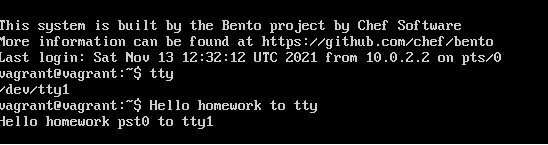

1. Какого типа команда cd? Попробуйте объяснить, почему она именно такого типа; опишите ход своих мыслей, если считаете что она могла бы быть другого типа.

Это команда встройенная.
Встройенная, потому что, работать внутри сессии терминала логичнее менять указатель на текущую дерикторию внутренней функцией, 
Если использовать внешний вызов, то он будет работать со своим окружением, и менять текущий каталог внутри своего окружения, а на вызвовший shell влиять не будет.  
Теоретически можно сделать CD внешней программой, но после смены деректории необходимо вызвать bash из этого (нового каталога), но тогда мы получим новый shell. И выходя из сесии придется выходить, опять же, из всех сессий, которые создали при каждом вызове внешней CD.

2. Какая альтернатива без pipe команде grep <some_string> <some_file> | wc -l? man grep поможет в ответе на этот вопрос. Ознакомьтесь с документом о других подобных некорректных вариантах использования pipe.

Ответ:

    vagrant@vagrant:~$ cat tst_bash
    if [[ -d /tmp ]];
    sdgsdfgfd
    sdgsdfgfghdgfd
    123
    vagrant@vagrant:~$ grep 123 tst_bash -c
    1
    vagrant@vagrant:~$ grep 123 tst_bash |wc -l
    1

3. Какой процесс с PID 1 является родителем для всех процессов в вашей виртуальной машине Ubuntu 20.04?

На хостовой машине  - systemd:

    0:25:28 alex@upc(0):~$ pstree -p
    systemd(1)─┬─ModemManager(1366)─┬─{ModemManager}(1392)
            │                    └─{ModemManager}(1419)

    На виртуальной машине  - systemd:
    vagrant@vagrant:~$ pstree -p
    systemd(1)─┬─VBoxService(754)─┬─{VBoxService}(755)
            │                  ├─{VBoxService}(756)
            │                  ├─{VBoxService}(757)

4. Как будет выглядеть команда, которая перенаправит вывод stderr ls на другую сессию терминала?

Ответ:
Вызов из pts/0:

    vagrant@vagrant:~$ ls -l \root 2> /dev/pts/1
    
Вывод в другой сессии pts/1:    

    vagrant@vagrant:~$ who
    vagrant  pts/0        2020-11-01 12:58 (10.0.2.2)
    vagrant  pts/1        2020-11-01 12:59 (10.0.2.2)
    vagrant@vagrant:~$ ls: cannot access 'root': No such file or directory

5. Получится ли одновременно передать команде файл на stdin и вывести ее stdout в другой файл? Приведите работающий пример.

Ответ:

    vagrant@vagrant:~$ cat tst_bash
    if [[ -d /tmp ]];
        sdgsdfgfd
        sdgsdfgfghdgfd
    vagrant@vagrant:~$ cat tst_bash_out
    cat: tst_bash_out: No such file or directory 
    vagrant@vagrant:~$ cat <tst_bash >tst_bash_out
    vagrant@vagrant:~$ cat tst_bash_out
    if [[ -d /tmp ]];
        sdgsdfgfd
        sdgsdfgfghdgfd
    vagrant@vagrant:~$ 

6. Получится ли вывести находясь в графическом режиме данные из PTY в какой-либо из эмуляторов TTY? Сможете ли вы наблюдать выводимые данные?

Ответ:

    vagrant@vagrant:~$ tty
    /dev/pts/0
    vagrant@vagrant:~$ echo Hello homework pst0 to tty1 > /dev/tty1

Аналогично можно сделать и из tty в pts

7. Выполните команду bash 5>&1. К чему она приведет? Что будет, если вы выполните echo netology > /proc/$$/fd/5? Почему так происходит?

Ответ:

`bash 5>&1` - Создаст дескриптор с 5 и перенаправит его в stdout
`echo netology > /proc/$$/fd/5` - выведет в дескриптор "5", который был пернеаправлен в stdout

если запустить `echo netology > /proc/$$/fd/5` в новой сесии, получим ошибку, так как такого дескриптора нет на данный момент в текущей(новой) сесии
    
    vagrant@vagrant:~$ echo netology > /proc/$$/fd/5
    -bash: /proc/1096/fd/5: No such file or directory
    vagrant@vagrant:~$ bash 5>&1
    vagrant@vagrant:~$ echo netology > /proc.$$/fd/5
    bash: /proc.1114/fd/5: No such file or directory
    vagrant@vagrant:~$ echo netology > /proc/$$/fd/5
    netology
    vagrant@vagrant:~$ 
    
8. Получится ли в качестве входного потока для pipe использовать только stderr команды, не потеряв при этом отображение stdout на pty? Напоминаем: по умолчанию через pipe передается только stdout команды слева от | на stdin команды справа. Это можно сделать, поменяв стандартные потоки местами через промежуточный новый дескриптор, который вы научились создавать в предыдущем вопросе.

Ответ:

    vagrant@vagrant:~$ ls -l /root 9>&2 2>&1 1>&9 |grep denied -c
    1

9. Что выведет команда `cat /proc/$$/environ`? Как еще можно получить аналогичный по содержанию вывод?

Ответ:

Будут выведены переменные окружения:
можно получить тоже самое (только с разделением по переменным по строкам):

    printenv
    env

10. Используя man, опишите что доступно по адресам `/proc/<PID>/cmdline`, `/proc/<PID>/exe`.

Ответ:

    /proc/<PID>/cmdline - полный путь до исполняемого файла процесса [PID]  (строка 231)
    /proc/<PID>/exe - содержит ссылку до файла запущенного для процесса [PID], cat выведет содержимое запущенного файла, запуск этого файла,  запустит еще одну копию самого файла  (строка 285)

11. Узнайте, какую наиболее старшую версию набора инструкций SSE поддерживает ваш процессор с помощью `/proc/cpuinfo`.

        SSE 4.2

12. При открытии нового окна терминала и vagrant ssh создается новая сессия и выделяется pty. Это можно подтвердить командой tty, которая упоминалась в лекции 3.2. Однако:

        vagrant@netology1:~$ ssh localhost 'tty'
        not a tty

Почитайте, почему так происходит, и как изменить поведение.

Ответ:

При подключении ожидается пользователь, а не другой процесс, и нет локального tty в данный момент. Для запуска можно добавить -t - , и команда исполняется c принудительным созданием псевдотерминала

    vagrant@vagrant:~$ ssh -t localhost 'tty'
    The authenticity of host 'localhost (::1)' can't be established.
    ECDSA key fingerprint is SHA256:wSHl+h4vAtTT7mbkj2lbGyxWXWTUf6VUliwpncjwLPM.
    Are you sure you want to continue connecting (yes/no/[fingerprint])? yes
    Warning: Permanently added 'localhost' (ECDSA) to the list of known hosts.
    vagrant@localhost's password:
    /dev/pts/1
    Connection to localhost closed.

13. Бывает, что есть необходимость переместить запущенный процесс из одной сессии в другую. Попробуйте сделать это, воспользовавшись reptyr. Например, так можно перенести в screen процесс, который вы запустили по ошибке в обычной SSH-сессии.

Ответ:

При первых запусках ругался на права, `10-patrace.conf`
после установки заначения  `kernel.yama.ptrace_scope = 0`
после чего процесс был перехвачен в screen, и продолжил работу после закрытия терминала. 
единственное в pstree процесс не отображался, точнее оботражался в виде процесса `reptyr`.

14. `sudo echo string > /root/new_file` не даст выполнить перенаправление под обычным пользователем, так как перенаправлением занимается процесс shell'а, который запущен без sudo под вашим пользователем. Для решения данной проблемы можно использовать конструкцию `echo string | sudo tee /root/new_file`. Узнайте что делает команда tee и почему в отличие от sudo echo команда с sudo tee будет работать.

Ответ:

    команда tee делает вывод одновременно и в файл, указаный в качестве параметра, и в stdout, 
    в данном примере команда получает вывод из stdin, перенаправленный через pipe от stdout команды echo
    и так как команда запущена от sudo , соотвественно имеет права на запись в файл 