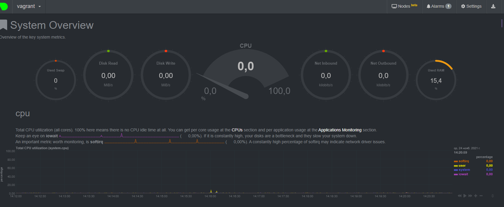

1. На лекции мы познакомились с node_exporter. В демонстрации его исполняемый файл запускался в background. Этого достаточно для демо, но не для настоящей production-системы, где процессы должны находиться под внешним управлением. Используя знания из лекции по systemd, создайте самостоятельно простой unit-файл для node_exporter:

* поместите его в автозагрузку,
* предусмотрите возможность добавления опций к запускаемому процессу через внешний файл (посмотрите, например, на systemctl cat cron),
* удостоверьтесь, что с помощью systemctl процесс корректно стартует, завершается, а после перезагрузки автоматически поднимается.

Ответ:

файл конфигурации 

    root@vagrant:/home/vagrant# systemctl cat node_exporter
    # /etc/systemd/system/node_exporter.service
    [Unit]
    Description=Node Exporter

    [Service]
    ExecStart=/usr/local/bin/node_exporter $OPTIONS
    EnvironmentFile=/etc/default/node_exporter

    [Install]
    WantedBy=default.target

Добавление в автозапуск

    root@vagrant:/home/vagrant# systemctl enable node_exporter
    Created symlink /etc/systemd/system/default.target.wants/node_exporter.service → /etc/systemd/system/node_exporter.service.

Проверка запуска процесса 

    root@vagrant:/home/vagrant# systemctl status node_expoter
    Unit node_expoter.service could not be found.
    root@vagrant:/home/vagrant# systemctl status node_exporter
    ● node_exporter.service - Node Exporter
        Loaded: loaded (/etc/systemd/system/node_exporter.service; enabled; vendor preset: enabled)
        Active: active (running) since Wed 2021-11-24 09:11:32 UTC; 5min ago
    Main PID: 1186 (node_exporter)
        Tasks: 6 (limit: 1071)
        Memory: 13.8M
        CGroup: /system.slice/node_exporter.service
                └─1186 /usr/local/bin/node_exporter

    Nov 24 09:11:32 vagrant node_exporter[1186]: time="2021-11-24T09:11:32Z" level=info msg=" - sockstat" source="node_exporter.go:104"
    Nov 24 09:11:32 vagrant node_exporter[1186]: time="2021-11-24T09:11:32Z" level=info msg=" - stat" source="node_exporter.go:104"
    Nov 24 09:11:32 vagrant node_exporter[1186]: time="2021-11-24T09:11:32Z" level=info msg=" - textfile" source="node_exporter.go:104"
    Nov 24 09:11:32 vagrant node_exporter[1186]: time="2021-11-24T09:11:32Z" level=info msg=" - time" source="node_exporter.go:104"
    Nov 24 09:11:32 vagrant node_exporter[1186]: time="2021-11-24T09:11:32Z" level=info msg=" - timex" source="node_exporter.go:104"
    Nov 24 09:11:32 vagrant node_exporter[1186]: time="2021-11-24T09:11:32Z" level=info msg=" - uname" source="node_exporter.go:104"
    Nov 24 09:11:32 vagrant node_exporter[1186]: time="2021-11-24T09:11:32Z" level=info msg=" - vmstat" source="node_exporter.go:104"
    Nov 24 09:11:32 vagrant node_exporter[1186]: time="2021-11-24T09:11:32Z" level=info msg=" - xfs" source="node_exporter.go:104"
    Nov 24 09:11:32 vagrant node_exporter[1186]: time="2021-11-24T09:11:32Z" level=info msg=" - zfs" source="node_exporter.go:104"
    Nov 24 09:11:32 vagrant node_exporter[1186]: time="2021-11-24T09:11:32Z" level=info msg="Listening on :9100" source="node_exporter.go:170"

* Дополнение к заданию: <b>Предлагаю уточнить как именно в службу будут передаваться дополнительные опции. Примеры можно посмотреть вот здесь:</b>

Ответ:

Предается по средством добавления из файла `EnvironmentFile` параметров окружения как в данном случае `OPTIONS`

    vagrant@vagrant:/etc/systemd/system$ sudo cat /proc/1809/environ
    LANG=en_US.UTF-8LANGUAGE=en_US:PATH=/usr/local/sbin:/usr/local/bin:/usr/sbin:/usr/bin:/sbin:/bin:/snap/bin
    INVOCATION_ID=0fcb24d52895405c875cbb9cbc28d3ffJOURNAL_STREAM=9:35758MYVAR=some_value
    OPTIONS="--collector.textfile.directory /var/lib/node_exporter/textfile_collector"
    vagrant@vagrant:cat /etc/default/node_exporter
    OPTIONS="--collector.textfile.directory /var/lib/node_exporter/textfile_collector"

2. Ознакомьтесь с опциями node_exporter и выводом /metrics по-умолчанию. Приведите несколько опций, которые вы бы выбрали для базового мониторинга хоста по CPU, памяти, диску и сети.

Ответ:

    CPU:
        node_cpu_seconds_total{cpu="0",mode="idle"} 2238.49
        node_cpu_seconds_total{cpu="0",mode="system"} 16.72
        node_cpu_seconds_total{cpu="0",mode="user"} 6.86
        process_cpu_seconds_total
        
    Memory:
        node_memory_MemAvailable_bytes 
        node_memory_MemFree_bytes
        
    Disk(если несколько дисков то для каждого):
        node_disk_io_time_seconds_total{device="sda"} 
        node_disk_read_bytes_total{device="sda"} 
        node_disk_read_time_seconds_total{device="sda"} 
        node_disk_write_time_seconds_total{device="sda"}
        
    Network(так же для каждого активного адаптера):
        node_network_receive_errs_total{device="eth0"} 
        node_network_receive_bytes_total{device="eth0"} 
        node_network_transmit_bytes_total{device="eth0"}
        node_network_transmit_errs_total{device="eth0"}

3. Установите в свою виртуальную машину Netdata. Воспользуйтесь готовыми пакетами для установки (sudo apt install -y netdata). После успешной установки:

* в конфигурационном файле /etc/netdata/netdata.conf в секции [web] замените значение с localhost на bind to = 0.0.0.0,
* добавьте в Vagrantfile проброс порта Netdata на свой локальный компьютер и сделайте vagrant reload

Ответ

В моем случае не было секции web поменял значение `bind socket to IP`

    [global]
        run as user = netdata
        web files owner = root
        web files group = root
        # Netdata is not designed to be exposed to potentially hostile
        # networks. See https://github.com/netdata/netdata/issues/164
        bind socket to IP = 0.0.0.0

4. Можно ли по выводу dmesg понять, осознает ли ОС, что загружена не на настоящем оборудовании, а на системе виртуализации?

Ответ:

Судя по выводу dmesg да, причем даже тип ВМ, так как есть соответсвующая строка: 

    root@vagrant:/home/vagrant# dmesg |grep virtualiz
    [0.000998] CPU MTRRs all blank - virtualized system.
    [0.068677] Booting paravirtualized kernel on KVM
    [0.201558] Performance Events: PMU not available due to virtualization, using software events only.
    [1.938682] systemd[1]: Detected virtualization oracle

5. Как настроен sysctl fs.nr_open на системе по-умолчанию? Узнайте, что означает этот параметр. Какой другой существующий лимит не позволит достичь такого числа (ulimit --help)?

Ответ:
    
    vagrant@vagrant:~$ /sbin/sysctl -n fs.nr_open
    1048576

Это максимальное число открытых дескрипторов для ядра (системы), для пользователя задать больше этого числа нельзя (если не менять). 
Число задается кратное 1024, в данном случае =1024*1024. 

Но макс.предел ОС можно посмотреть так :

    vagrant@vagrant:~$ cat /proc/sys/fs/file-max
    9223372036854775807
    vagrant@vagrant:~$ ulimit -Sn
    1024

мягкий лимит (так же ulimit -n)на пользователя (может быть увеличен процессов в процессе работы)

    vagrant@vagrant:~$ ulimit -Hn
    1048576

жесткий лимит на пользователя (не может быть увеличен, только уменьшен)

Оба ulimit -n НЕ могут превысить системный fs.nr_open

6. Запустите любой долгоживущий процесс (не ls, который отработает мгновенно, а, например, sleep 1h) в отдельном неймспейсе процессов; покажите, что ваш процесс работает под PID 1 через nsenter. Для простоты работайте в данном задании под root (sudo -i). Под обычным пользователем требуются дополнительные опции (--map-root-user) и т.д.

Ответ:

    root@vagrant:~# ps -e |grep sleep
    2020 pts/2    00:00:00 sleep
    root@vagrant:~# nsenter --target 2020 --pid --mount
    root@vagrant:/# ps
        PID TTY          TIME CMD
        2 pts/0    00:00:00 bash
        11 pts/0    00:00:00 ps

7. Найдите информацию о том, что такое :(){ :|:& };:. Запустите эту команду в своей виртуальной машине Vagrant с Ubuntu 20.04 (это важно, поведение в других ОС не проверялось). Н екоторое время все будет "плохо", после чего (минуты) – ОС должна стабилизироваться. Вызов dmesg расскажет, какой механизм помог автоматической стабилизации. Как настроен этот механизм по-умолчанию, и как изменить число процессов, которое можно создать в сессии?

Ответ:

    Из предыдущих лекций ясно что это функция внутри "{}", судя по всему с именем ":" , которая после опредения в строке запускает саму себя.
    внутринности через поиск нагуглил, пораждает два фоновых процесса самой себя,
    получается этакое бинарное дерево плодящее процессы 

    А функционал судя по всему этот:
    [ 3099.973235] cgroup: fork rejected by pids controller in /user.slice/user-1000.slice/session-4.scope
    [ 3103.171819] cgroup: fork rejected by pids controller in /user.slice/user-1000.slice/session-11.scope

    Судя по всему, система на основании этих файлов в пользовательской зоне ресурсов имеет определенное ограничение на создаваемые ресурси 
    и соответсвенно при превышении начинает блокировать создание числа 

    Если установить ulimit -u 50 - число процессов будет ограниченно 50 для пользоователя. 