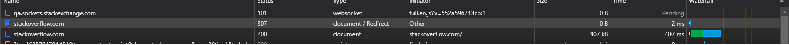
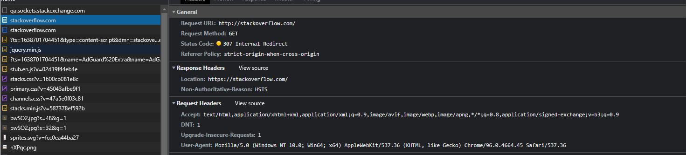

1. Работа c HTTP через телнет.
- Подключитесь утилитой телнет к сайту stackoverflow.com
`telnet stackoverflow.com 80`
- отправьте HTTP запрос
```bash
GET /questions HTTP/1.0
HOST: stackoverflow.com
[press enter]
[press enter]
```
- В ответе укажите полученный HTTP код, что он означает?

Ответ:

    twiss@twiss:/mnt/c/Users/dmozo$ telnet stackoverflow.com 80
    Trying 151.101.129.69...
    Connected to stackoverflow.com.
    Escape character is '^]'.
    GET /questions HTTP/1.0
    HOST: stackoverflow.com

    HTTP/1.1 301 Moved Permanently # редирект на https
    cache-control: no-cache, no-store, must-revalidate
    location: https://stackoverflow.com/questions # состояние ссылки после редиректа
    x-request-guid: a72d160c-635c-43be-8e7d-5d63e00ea948 # идентификатор запроса 
    feature-policy: microphone 'none'; speaker 'none'
    content-security-policy: upgrade-insecure-requests; frame-ancestors 'self' https://stackexchange.com
    Accept-Ranges: bytes
    Date: Sun, 05 Dec 2021 10:51:07 GMT # время запроса
    Via: 1.1 varnish
    Connection: close
    X-Served-By: cache-hel1410029-HEL
    X-Cache: MISS
    X-Cache-Hits: 0
    X-Timer: S1638701467.035471,VS0,VE110
    Vary: Fastly-SSL
    X-DNS-Prefetch-Control: off
    Set-Cookie: prov=d12b6c84-8e17-50e8-4cec-fa3f505c2d61; domain=.stackoverflow.com; expires=Fri, 01-Jan-2055 00:00:00 GMT; path=/; HttpOnly

    Connection closed by foreign host.

2. Повторите задание 1 в браузере, используя консоль разработчика F12.
- откройте вкладку `Network`
- отправьте запрос http://stackoverflow.com
- найдите первый ответ HTTP сервера, откройте вкладку `Headers`
- укажите в ответе полученный HTTP код.
- проверьте время загрузки страницы, какой запрос обрабатывался дольше всего?
- приложите скриншот консоли браузера в ответ.




3. Какой IP адрес у вас в интернете?

Ответ: `9.145.255.144`

4. Какому провайдеру принадлежит ваш IP адрес? Какой автономной системе AS? Воспользуйтесь утилитой `whois`

Ответ:

    % Information related to '9.145.255.144'

    route:          9.145.255.144/24
    descr:          JSC "Ufanet", Ufa, Russia
    origin:         AS24955
    mnt-by:         UBN-MNT
    created:        2018-08-15T03:28:44Z
    last-modified:  2018-08-15T03:28:44Z
    source:         RIPE

5. Через какие сети проходит пакет, отправленный с вашего компьютера на адрес 8.8.8.8? Через какие AS? Воспользуйтесь утилитой `traceroute`

```twiss@twiss:/mnt/c/Users/dmozo/Desktop/devops-netology$ traceroute 8.8.8.8 -m 10 -I
traceroute to 8.8.8.8 (8.8.8.8), 10 hops max
4   10.2.3.17  0.767ms  0.701ms  4.717ms
5   10.1.84.33  1.530ms  1.138ms  1.073ms 
6   10.1.65.9  0.734ms  0.680ms  0.615ms
7   10.1.65.65  1.065ms  0.917ms  0.940ms
8   10.3.1.13  27.618ms  26.872ms  27.790ms 
9   72.14.220.188  23.845ms  23.574ms  23.694ms 
10   142.251.68.223  28.054ms  28.137ms  27.864ms
```
 
 
6. Повторите задание 5 в утилите `mtr`. На каком участке наибольшая задержка - delay?

```
twiss (10.3.2.5) -> 8.8.8.8                                                                                                                                                     2021-12-05T16:33:49+0500
Keys:  Help   Display mode   Restart statistics   Order of fields   quit
                                                                                                                                                                        Packets               Pings
 Host                                                                                                                                                                 Loss%   Snt   Last   Avg  Best  Wrst StDev

 3. cmir-core-te0103.ufa.ufanet.ru                                                                                                                                     0.0%   120    2.2   3.4   2.0 104.6   9.6
 4. 10.1.190.38                                                                                                                                                        0.0%   120    1.9   4.2   1.5 247.1  23.0
 5. 10.2.3.137                                                                                                                                                         0.0%   120    2.3   4.2   2.0 205.6  18.6
 6. 10.2.3.17                                                                                                                                                          0.0%   120    1.9   6.7   1.8 277.6  29.6
 7. 10.1.190.182                                                                                                                                                       0.0%   120    2.3   5.8   1.9 236.5  24.0
 8. 10.3.1.13                                                                                                                                                          0.0%   120   19.7  21.0  18.2 194.4  16.9
 9. 72.14.220.188                                                                                                                                                      0.0%   120   19.5  20.7  19.0 153.3  12.3
10. 142.251.68.221                                                                                                                                                     0.0%   120   18.6  19.6  18.5 112.0   8.5
11. 108.170.250.83                                                                                                                                                    16.0%   120   24.4  25.7  23.7  69.8   5.4
12. 142.250.239.64                                                                                                                                                    65.5%   120   34.3  34.4  33.7  40.2   1.1
13. 172.253.66.110                                                                                                                                                     0.0%   120   39.5  39.7  38.9  47.7   1.2
14. 216.239.58.65                                                                                                                                                      0.0%   120   40.7  44.7  40.2 300.6  26.1
15. (waiting for reply)
16. (waiting for reply)
17. (waiting for reply)
18. (waiting for reply)
19. (waiting for reply)
20. (waiting for reply)
21. (waiting for reply)
22. (waiting for reply)
23. (waiting for reply)
24. dns.google                                                                                                                                                        48.3%   120   31.7  32.3  30.6  33.7   1.1
```
7. Какие DNS сервера отвечают за доменное имя dns.google? Какие A записи? воспользуйтесь утилитой `dig`

Ответ:

```
;; ANSWER SECTION:
dns.google.             36      IN      A       8.8.4.4
dns.google.             36      IN      A       8.8.8.8
```
8. Проверьте PTR записи для IP адресов из задания 7. Какое доменное имя привязано к IP? воспользуйтесь утилитой `dig`

Ответ:

```
;; AUTHORITY SECTION:
in-addr.arpa.           10      IN      SOA     b.in-addr-servers.arpa. nstld.iana.org. 2021111715 1800 900 604800 3600
```