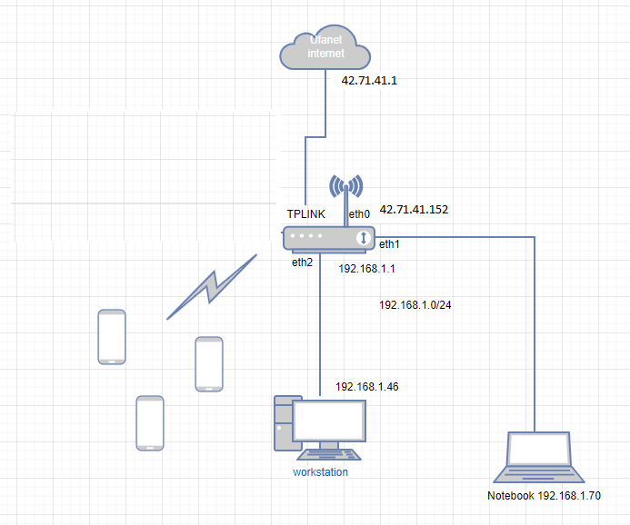

1. Подключитесь к публичному маршрутизатору в интернет. Найдите маршрут к вашему публичному IP
```
route-views>sh ip route 42.71.41.152
Routing entry for 42.71.41.0/23
  Known via "bgp 6447", distance 20, metric 0
  Tag 6939, type external
  Last update from 64.71.137.241 2d10h ago
  Routing Descriptor Blocks:
  * 64.71.137.241, from 64.71.137.241, 2d10h ago
      Route metric is 0, traffic share count is 1
      AS Hops 2
      Route tag 6939
      MPLS label: none
route-views>show bgp 42.71.41.152
BGP routing table entry for 42.71.41.0/23, version 1412318329
Paths: (4 available, best #4, table default)
  Not advertised to any peer
  Refresh Epoch 1
  20130 6939 24955
    140.192.8.16 from 140.192.8.16 (140.192.8.16)
      Origin IGP, localpref 100, valid, external
      path 7FE0121400B8 RPKI State valid
      rx pathid: 0, tx pathid: 0
  Refresh Epoch 3
  3303 24955
    217.192.89.50 from 217.192.89.50 (138.187.128.158)
      Origin IGP, localpref 100, valid, external
      Community: 3303:1004 3303:1006 3303:1030 3303:1031 3303:3081 24955:310 24955:321 24955:3210 24955:3213 24955:3216 24955:40103 31210:24955 65005:10643
      path 7FE108F029C8 RPKI State valid
      rx pathid: 0, tx pathid: 0
  Refresh Epoch 1
  1351 6939 24955
    132.198.255.253 from 132.198.255.253 (132.198.255.253)
      Origin IGP, localpref 100, valid, external
      path 7FE12C803870 RPKI State valid
      rx pathid: 0, tx pathid: 0
  Refresh Epoch 1
  6939 24955
    64.71.137.241 from 64.71.137.241 (216.218.252.164)
      Origin IGP, localpref 100, valid, external, best
      path 7FE18B6F5428 RPKI State valid
      rx pathid: 0, tx pathid: 0x0
route-views>
```


2. Создайте dummy0 интерфейс в Ubuntu. Добавьте несколько статических маршрутов. Проверьте таблицу маршрутизации.

```
auto dummy0
iface dummy0 inet static
address 192.168.1.150
netmask 255.255.255.0

oot@Devops:/# ip a
1: lo: <LOOPBACK,UP,LOWER_UP> mtu 65536 qdisc noqueue state UNKNOWN group default qlen 1000
    link/loopback 00:00:00:00:00:00 brd 00:00:00:00:00:00
    inet 127.0.0.1/8 scope host lo
       valid_lft forever preferred_lft forever
    inet6 ::1/128 scope host 
       valid_lft forever preferred_lft forever
2: ens33: <BROADCAST,MULTICAST,UP,LOWER_UP> mtu 1500 qdisc pfifo_fast state UP group default qlen 1000
    link/ether 00:0c:29:e9:40:3c brd ff:ff:ff:ff:ff:ff
    altname enp2s1
    inet 192.168.148.138/24 brd 192.168.148.255 scope global dynamic noprefixroute ens33
       valid_lft 1426sec preferred_lft 1426sec
    inet6 fe80::20c:29ff:fee9:403c/64 scope link noprefixroute 
       valid_lft forever preferred_lft forever
3: dummy0: <BROADCAST,NOARP> mtu 1500 qdisc noop state DOWN group default qlen 1000
    link/ether da:03:a4:07:53:59 brd ff:ff:ff:ff:ff:ff
    inet 192.168.1.150/24 scope global dummy0
       valid_lft forever preferred_lft forever


ip route show
default via 192.168.148.2 dev ens33 proto dhcp metric 100 
172.16.0.0/16 via 192.168.148.138 dev ens33 scope link 
172.91.10.0/29 via 192.168.148.138 dev ens33 scope link 
192.168.148.0/24 dev ens33 proto kernel scope link src 192.168.148.138 metric 100 
```


3. Проверьте открытые TCP порты в Ubuntu, какие протоколы и приложения используют эти порты? Приведите несколько примеров.

```
sudo netstat -plnut
Active Internet connections (only servers)
Proto Recv-Q Send-Q Local Address           Foreign Address         State       PID/Program name    
tcp        0      0 0.0.0.0:22              0.0.0.0:*               LISTEN      648/sshd: /usr/sbin 
tcp6       0      0 :::22                   :::*                    LISTEN      648/sshd: /usr/sbin 
udp        0      0 0.0.0.0:5353            0.0.0.0:*                           533/avahi-daemon: r 
udp        0      0 127.0.0.1:161           0.0.0.0:*                           3786/snmpd          
udp        0      0 0.0.0.0:53755           0.0.0.0:*                           533/avahi-daemon: r 
udp6       0      0 :::43627                :::*                                533/avahi-daemon: r 
udp6       0      0 :::5353                 :::*                                533/avahi-daemon: r 
udp6       0      0 ::1:161                 :::*                                3786/snmpd          
root@Devops:/# 
```
Открыт 22 порт tcp ssh, это протокол удаленного администрирования. Использует клиенты ssh например putty
Так же в зависимости от использумых сервисов и приложений, могут быть открыты например:
80 и 443 порты http и https например firefox, chrome
или 20,21 tcp для ftp например клиент FileZilla

4. Проверьте используемые UDP сокеты в Ubuntu, какие протоколы и приложения используют эти порты?
```
netstat -an
  UDP    0.0.0.0:53             *:*
  UDP    0.0.0.0:123            *:*
  UDP    192.168.1.103:137      *:*
  UDP    192.168.1.103:138		*:*
```

53 - DNS 
123 - NTP - сервер времени
137 - NetBios сетевой протокол обнаружения, напрмимер для работы с сетевыми папками.


5. Используя diagrams.net, создайте L3 диаграмму вашей домашней сети или любой другой сети, с которой вы работали.



