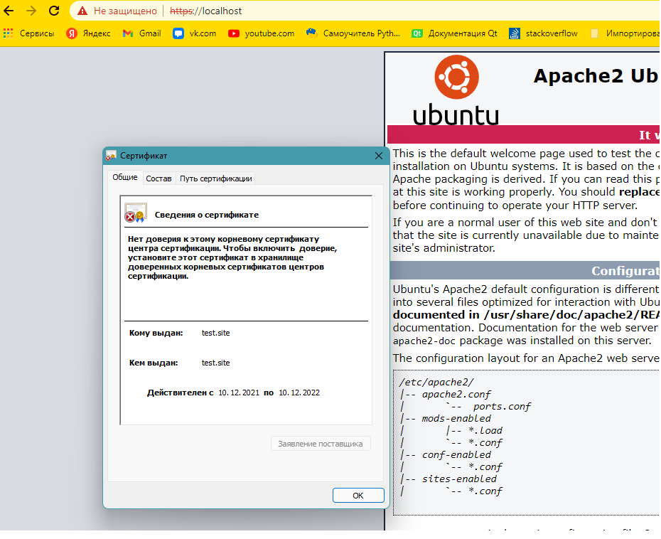
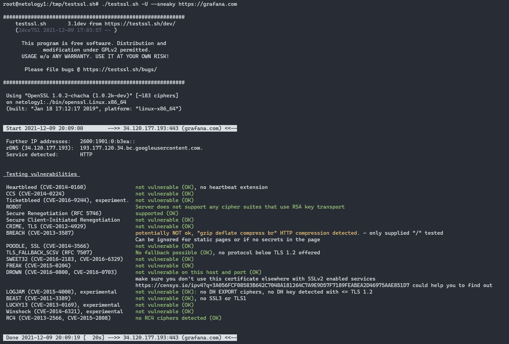
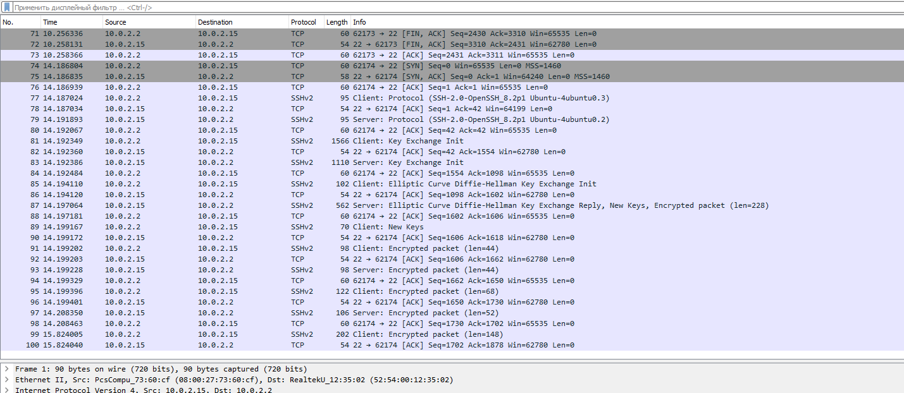

1. Установите Bitwarden плагин для браузера. Зарегестрируйтесь и сохраните несколько паролей.
Сделано 

2. Установите Google authenticator на мобильный телефон. Настройте вход в Bitwarden акаунт через Google authenticator OTP.
Сделано

3. Установите apache2, сгенерируйте самоподписанный сертификат, настройте тестовый сайт для работы по HTTPS.

4. Проверьте на TLS уязвимости произвольный сайт в интернете (кроме сайтов МВД, ФСБ, МинОбр, НацБанк, РосКосмос, РосАтом, РосНАНО и любых госкомпаний, объектов КИИ, ВПК ... и тому подобное).

5. Установите на Ubuntu ssh сервер, сгенерируйте новый приватный ключ. Скопируйте свой публичный ключ на другой сервер. Подключитесь к серверу по SSH-ключу.

Ответ:

    sudo apt install openssh-server
    root@netology1:/tmp/testssl.sh# ssh-keygen
    Generating public/private rsa key pair.
    Enter file in which to save the key (/root/.ssh/id_rsa):
    Created directory '/root/.ssh'.
    Enter passphrase (empty for no passphrase):
    Enter same passphrase again:
    Your identification has been saved in /root/.ssh/id_rsa
    Your public key has been saved in /root/.ssh/id_rsa.pub
    The key fingerprint is:
    SHA256:y2J7pVi8XqYOwONeElMXjvfBRqH3OXWDigoMc root@netology1
    The key's randomart image is:
    +---[RSA 3072]----+
    |      ..o..o+... |
    |      o*.oT..Bo .|
    |     .+E=.o.o.o..|
    |   . G.+ o . + . |
    |    *   S . .    |
    |   . = B +       |
    |    o O B o      |
    |   . - = +       |
    |    .  .+        |
    +----[SHA496]-----+

    ssh-copy-id root@10.0.2.1
 
6. Переименуйте файлы ключей из задания 5. Настройте файл конфигурации SSH клиента, так чтобы вход на удаленный сервер осуществлялся по имени сервера.

Ответ:

    root@netology1:~/.ssh# mv id_rsa test
    root@netology1:~/.ssh# mv id_rsa.pub test.pub
    root@netology1:~/.ssh# cat /etc/ssh/ssh_config

    Include /etc/ssh/ssh_config.d/*.conf

    Host test
    HostName 10.0.2.1
    User root
    IdentityFile ~/.ssh/test
    twiss@twiss:/mnt/c/Users/dmozo$ ssh test
    Welcome to Ubuntu 20.04.2 LTS (GNU/Linux 5.4.0-80-generic x86_64)

    * Documentation:  https://help.ubuntu.com
    * Management:     https://landscape.canonical.com
    * Support:        https://ubuntu.com/advantage

    System information as of Thu 09 Dec 2021 08:17:11 PM UTC

    System load:  0.0               Processes:             114
    Usage of /:   2.5% of 61.31GB   Users logged in:       0
    Memory usage: 23%               IPv4 address for eth0: 10.0.2.15
    Swap usage:   0%                IPv4 address for eth1: 172.28.128.10

    This system is built by the Bento project by Chef Software
    More information can be found at https://github.com/chef/bento
    Last login: Thu Dec  9 19:50:12 2021 from 10.0.2.1
    vagrant@netology1:~$

7. Соберите дамп трафика утилитой tcpdump в формате pcap, 100 пакетов. Откройте файл pcap в Wireshark.

