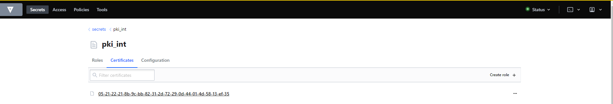
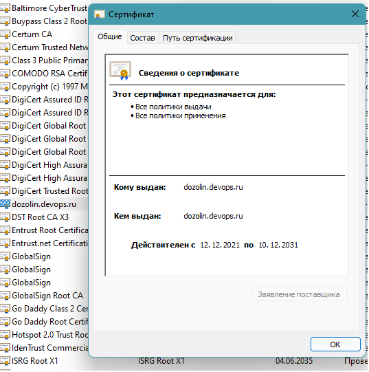
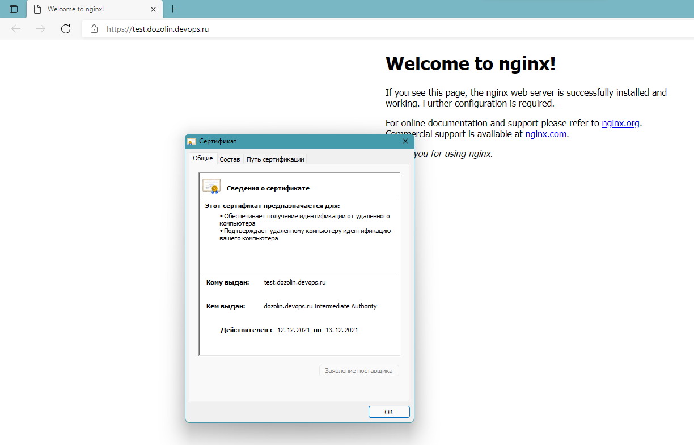
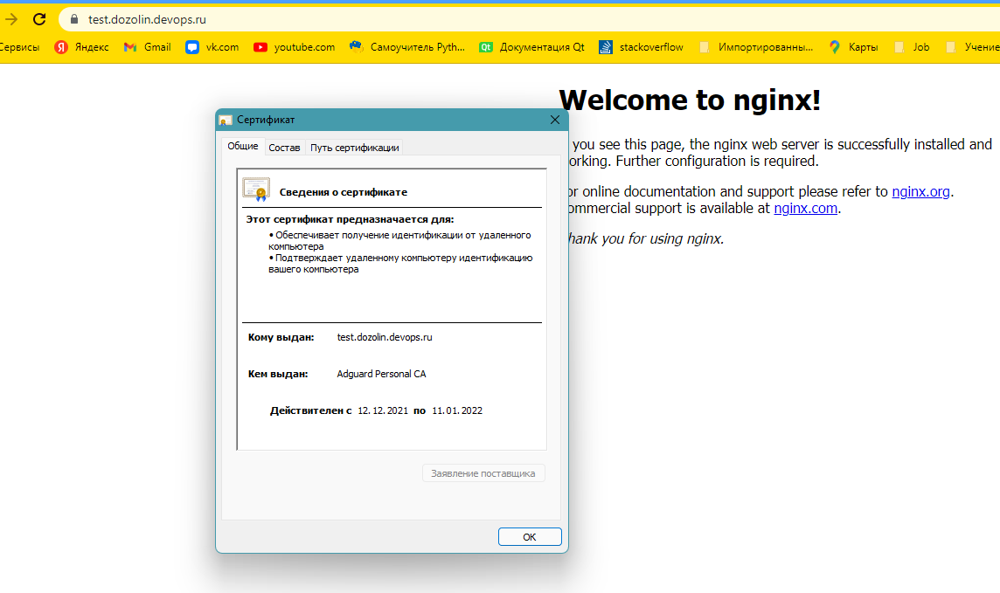

1. Создайте виртуальную машину Linux.

Конфиг Vagrant
```ruby
# -*- mode: ruby -*-
# vi: set ft=ruby :
Vagrant.configure("2") do |config|
  config.vm.box = "bento/ubuntu-20.04"

end
```
`vagrant up`

2. Установите ufw и разрешите к этой машине сессии на порты 22 и 443, при этом трафик на интерфейсе localhost (lo) должен ходить свободно на все порты.

Ответ:

Для начала включил `ufw enable`  
Установил nginx `apt install -y nginx`

После установки `nginx` создался дополнительный конфиг для ufw 

```
root@vagrant:/home/vagrant# cat /etc/ufw/applications.d/nginx
[Nginx HTTP]
title=Web Server (Nginx, HTTP)
description=Small, but very powerful and efficient web server
ports=80/tcp

[Nginx HTTPS]
title=Web Server (Nginx, HTTPS)
description=Small, but very powerful and efficient web server
ports=443/tcp

[Nginx Full]
title=Web Server (Nginx, HTTP + HTTPS)
description=Small, but very powerful and efficient web server
ports=80,443/tcp
```
Открыл порты `https/443, ssh/22` и закрыл порт `http/80` так же открыл полный доступ через `localhost` 

```
root@vagrant:/home/vagrant# ufw allow 'Nginx HTTPS'
Skipping adding existing rule
Skipping adding existing rule (v6)
root@vagrant:/home/vagrant# ufw allow 'Openssh'
Skipping adding existing rule
Skipping adding existing rule (v6)
root@vagrant:/home/vagrant# ufw deny 'Nginx HTTP'
Skipping adding existing rule
Skipping adding existing rule (v6)
root@vagrant:/home/vagrant# ufw allow from 127.0.0.1
Skipping adding existing rule
root@vagrant:/home/vagrant# ufw status verbose
Status: active
Logging: on (low)
Default: deny (incoming), allow (outgoing), disabled (routed)
New profiles: skip

To                         Action      From
--                         ------      ----
22/tcp (OpenSSH)           ALLOW IN    Anywhere
443/tcp (Nginx HTTPS)      ALLOW IN    Anywhere
80/tcp (Nginx HTTP)        DENY IN     Anywhere
Anywhere                   ALLOW IN    127.0.0.1
22/tcp (OpenSSH (v6))      ALLOW IN    Anywhere (v6)
443/tcp (Nginx HTTPS (v6)) ALLOW IN    Anywhere (v6)
80/tcp (Nginx HTTP (v6))   DENY IN     Anywhere (v6)
root@vagrant:/home/vagrant#
```
Так же проверил `telnet`ом открыт ли порт `http/80` со своего локального компьютера и с виртуалки

``` 
root@vagrant:/home/vagrant# ip a
1: lo: <LOOPBACK,UP,LOWER_UP> mtu 65536 qdisc noqueue state UNKNOWN group default qlen 1000
    link/loopback 00:00:00:00:00:00 brd 00:00:00:00:00:00
    inet 127.0.0.1/8 scope host lo
       valid_lft forever preferred_lft forever
    inet6 ::1/128 scope host
       valid_lft forever preferred_lft forever
2: eth0: <BROADCAST,MULTICAST,UP,LOWER_UP> mtu 1500 qdisc fq_codel state UP group default qlen 1000
    link/ether 08:00:27:73:60:cf brd ff:ff:ff:ff:ff:ff
    inet 192.168.0.14/24 brd 192.168.0.255 scope global dynamic eth0
       valid_lft 76206sec preferred_lft 76206sec
    inet6 fd01::a00:27ff:fe73:60cf/64 scope global dynamic mngtmpaddr noprefixroute
       valid_lft 282sec preferred_lft 282sec
    inet6 fe80::a00:27ff:fe73:60cf/64 scope link
       valid_lft forever preferred_lft forever
root@vagrant:/home/vagrant# telnet localhost 80
Trying ::1...
Connected to localhost.
Escape character is '^]'.
^]q

telnet> q
Connection closed.
root@vagrant:/home/vagrant# exit
vagrant@vagrant:~$ logout
Connection to 192.168.0.14 closed.
twiss@twiss:/mnt/c/Users/dmozo/Desktop/vmVagrant$ telnet 192.168.0.14 80
Trying 192.168.0.14...
telnet: Unable to connect to remote host: Resource temporarily unavailable
```

3. Установите hashicorp vault ([инструкция по ссылке](https://learn.hashicorp.com/tutorials/vault/getting-started-install?in=vault/getting-started#install-vault)).

Ответ:

    Установил
    curl -fsSL https://apt.releases.hashicorp.com/gpg | sudo apt-key add -
    sudo apt-add-repository "deb [arch=amd64] https://apt.releases.hashicorp.com $(lsb_release -cs) main"
    sudo apt-get update && sudo apt-get install vault
    systemctl start vault && systemctl enable vault

4. Cоздайте центр сертификации по инструкции ([ссылка](https://learn.hashicorp.com/tutorials/vault/pki-engine?in=vault/secrets-management)) и выпустите сертификат для использования его в настройке веб-сервера nginx (срок жизни сертификата - месяц).

Ответ:

Следуя документации создал корневой сертификат и доверительный 


    vault operator init
    vault operator unseal
    vault secrets enable pki
    vault secrets tune -max-lease-ttl=87600h pki
    vault write -field=certificate pki/root/generate/internal      common_name="dozolin.devops.ru"      ttl=87600h > CA_cert.crt
    vault write pki/config/urls      issuing_certificates="$VAULT_ADDR/v1/pki/ca"      crl_distribution_points="$VAULT_ADDR/v1/pki/crl"
    vault secrets enable -path=pki_int pki
    vault secrets tune -max-lease-ttl=43800h pki_int
    vault write -format=json pki_int/intermediate/generate/internal common_name="dozolin.devops.ru Intermediate Authority" | jq -r '.data.csr' > pki_intermediate.csr
    vault write -format=json pki/root/sign-intermediate csr=@pki_intermediate.csr      format=pem_bundle ttl="43800h"      | jq -r '.data.certificate' > intermediate.cert.pem
    vault write pki_int/intermediate/set-signed certificate=@intermediate.cert.pem
    vault write pki_int/issue/example-dot-com common_name="test.dozolin.devops.ru" ttl="720h"



5. Установите корневой сертификат созданного центра сертификации в доверенные в хостовой системе.

Ответ:
установил 



6. Установите nginx.
```
root@vagrant:~# apt install nginx
Reading package lists... Done
Building dependency tree
Reading state information... Done
nginx is already the newest version (1.18.0-0ubuntu1.2).
0 upgraded, 0 newly installed, 0 to remove and 0 not upgraded.
```
7. По инструкции ([ссылка](https://nginx.org/en/docs/http/configuring_https_servers.html)) настройте nginx на https, используя ранее подготовленный сертификат:
  - можно использовать стандартную стартовую страницу nginx для демонстрации работы сервера;
  - можно использовать и другой html файл, сделанный вами;

```nginx
server {
  listen 443 ssl default_server;
  listen [::]:443 ssl default_server;
  ssl_certificate  /etc/cert_script/certificate.pem;
  ssl_certificate_key /etc/cert_script/private_key.pem;
  ssl_trusted_certificate /etc/cert_script/ca_chain.pem;
  root /var/www/html;
  server_name test.dozolin.devops.ru;
  location / {
          try_files $uri $uri/ =404;
  }
}
```
8. Откройте в браузере на хосте https адрес страницы, которую обслуживает сервер nginx.

`MSEdge ( с тестовым 1 дневным сертификатом )`

`Chrome ( с 30 дневным сертификатом )`


9. Создайте скрипт, который будет генерировать новый сертификат в vault:
  - генерируем новый сертификат так, чтобы не переписывать конфиг nginx;
  - перезапускаем nginx для применения нового сертификата.

Ответ:

* [Python версия генерации ssl](script/generate_ssl.py) 
* [Bash версия генерации ssl](script/generate_ssl.sh)
10. Поместите скрипт в crontab, чтобы сертификат обновлялся какого-то числа каждого месяца в удобное для вас время.

```bash
crontab -l
# m h  dom mon dow   command
0 0 1 1-12 * python3 /etc/cert_script/main.py
# 0 0 1 1-12 * sh /etc/cert_script/generate.sh
```
Поставил ради примера работы cron на раз в минуту 
```bash
* * * * * python3 /etc/cert_script/main.py
* * * * * sh /etc/cert_script/generate.sh
root@vagrant:~# grep CRON /var/log/syslog

Dec 12 18:20:01 vagrant CRON[8994]: (root) CMD (python3 /etc/cert_script/main.py)
Dec 12 18:21:01 vagrant CRON[9018]: (root) CMD (python3 /etc/cert_script/main.py)
Dec 12 18:22:01 vagrant CRON[9027]: (root) CMD (python3 /etc/cert_script/main.py)
Dec 12 19:01:01 vagrant CRON[11387]: (root) CMD (sh /etc/cert_script/generate.sh )
Dec 12 19:02:01 vagrant CRON[11392]: (root) CMD (sh /etc/cert_script/generate.sh )
Dec 12 19:03:01 vagrant CRON[11401]: (root) CMD (sh /etc/cert_script/generate.sh )

systemctl status nginx
● nginx.service - A high performance web server and a reverse proxy server
     Loaded: loaded (/lib/systemd/system/nginx.service; enabled; vendor preset: enabled)
     Active: active (running) since Sun 2021-12-12 18:00:04 UTC; 1h 37min ago
       Docs: man:nginx(8)
    Process: 8400 ExecStartPre=/usr/sbin/nginx -t -q -g daemon on; master_process on; (code=exited, status=0/SUCCESS)
    Process: 8401 ExecStart=/usr/sbin/nginx -g daemon on; master_process on; (code=exited, status=0/SUCCESS)
    Process: 11412 ExecReload=/usr/sbin/nginx -g daemon on; master_process on; -s reload (code=exited, status=0/SUCCESS)
   Main PID: 8412 (nginx)
      Tasks: 3 (limit: 1112)
     Memory: 6.9M
     CGroup: /system.slice/nginx.service
             ├─ 8412 nginx: master process /usr/sbin/nginx -g daemon on; master_process on;
             ├─11413 nginx: worker process
             └─11414 nginx: worker process

Dec 12 18:20:01 vagrant systemd[1]: Reloading A high performance web server and a reverse proxy server.
Dec 12 18:21:01 vagrant systemd[1]: Reloaded A high performance web server and a reverse proxy server.
Dec 12 18:22:01 vagrant systemd[1]: Reloading A high performance web server and a reverse proxy server.
Dec 12 19:01:01 vagrant systemd[1]: Reloading A high performance web server and a reverse proxy server.
Dec 12 19:02:01 vagrant systemd[1]: Reloaded A high performance web server and a reverse proxy server.
Dec 12 19:03:01 vagrant systemd[1]: Reloading A high performance web server and a reverse proxy server.
```